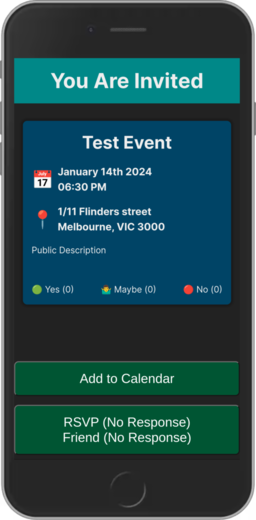

# RSVP Service

I know there are existing services online, but figured it could be fun to start another one to add some code to my GitHub haha

This is a side project made to manage invitations to events. I am using this for inviting people to Jackbox game nights. But feel free to use this for personal use. This is very MVP.

## Deployments

Currently hosted at [my personal site](https://events.natelubitz.com/)

## Developer docs

1. NodeJS / Golang should be installed. SQLite is the current db (MVP)
2. Copy backend/.env.sample > backend/.env.local
3. Copy frontend/.env.sample > frontend/.env.local
4. In frontend - `npm run dev`
5. In backend - `go run server.go`

## Application Usage

You create invitations on the Admin Dashboard. You copy the links and send them to people. They can then RSVP. History is tracked, but not surfaced yet.

Images compressed to keep size low

### Invitation

A user can RSVP to an event, or download a calendar event into their personal calendar. Updates you make won't be reflected as the downloaded calendar is completely offline.

After a person has clicked your link, the ID is saved to local storage so they can return to the same event

### Admin Dashboard

> localhost:5173/admin

Paste in an API key (you set this in the backend env file), then you can create Events, People, and Groups.

#### People and Groups

You can create people that you can later add to events

#### Groups

You can create groups for people who regularly go to the same event (IE your Tuesday night Among Us group)

#### Events

You can manage your events, see who is going, and create a new events

You can invite groups of people or just individual people. Clicking an invited person on the invite page revokes the invitation.

Clicking the clipboard copies the link to the invitation so you can send it to a friend

